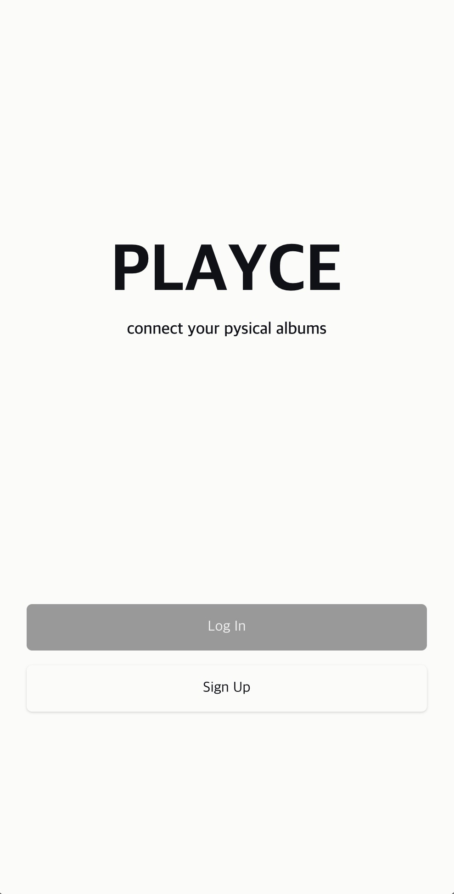
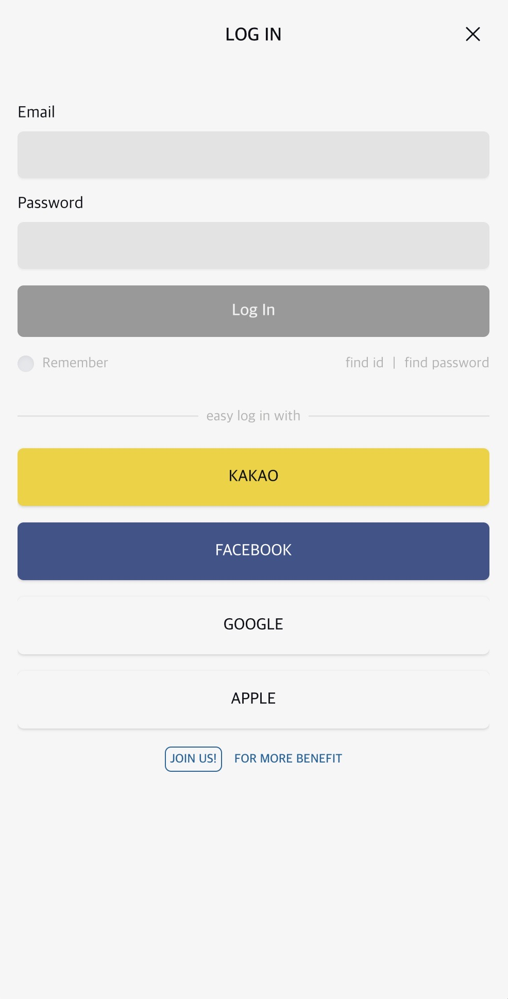
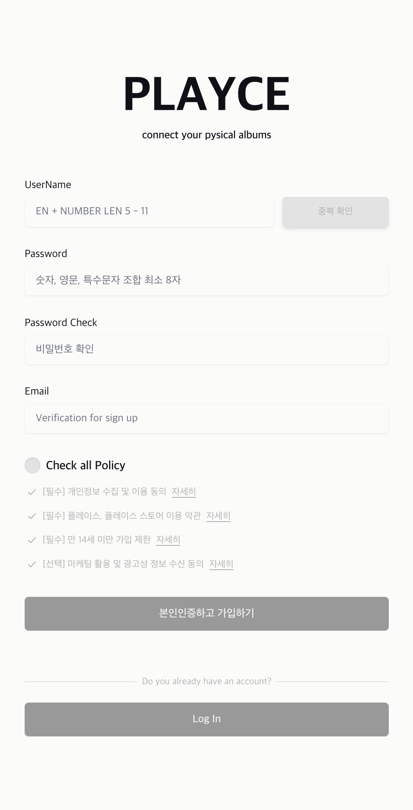
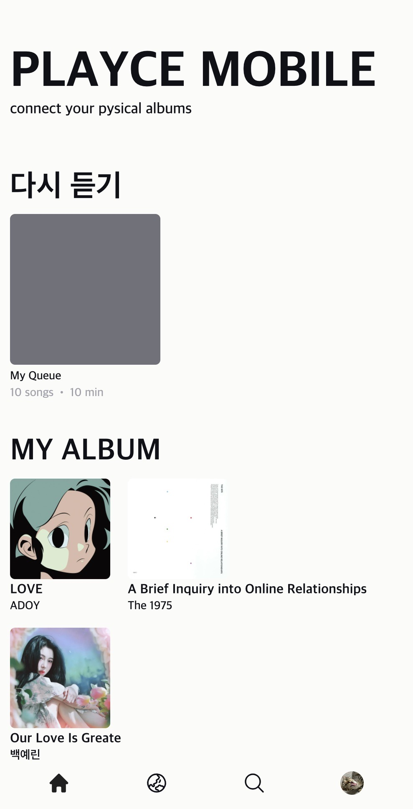
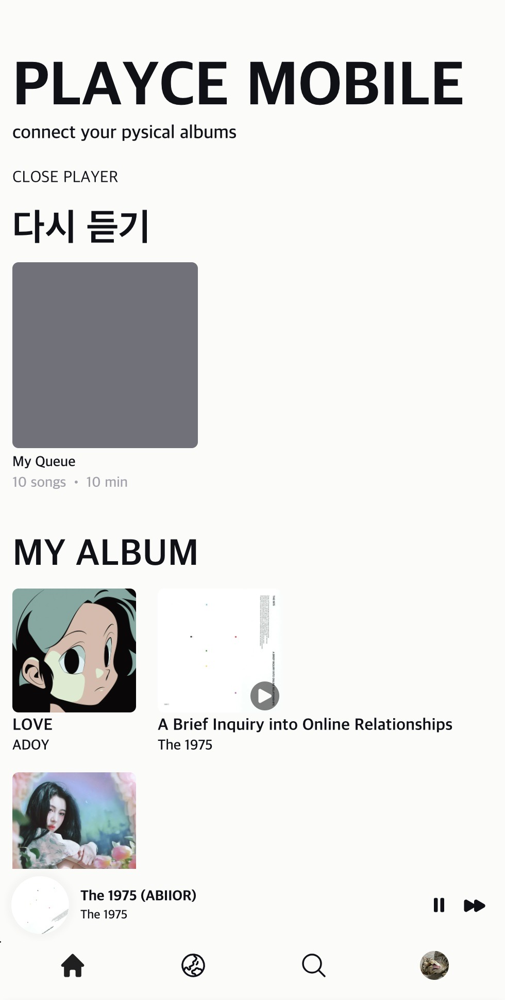
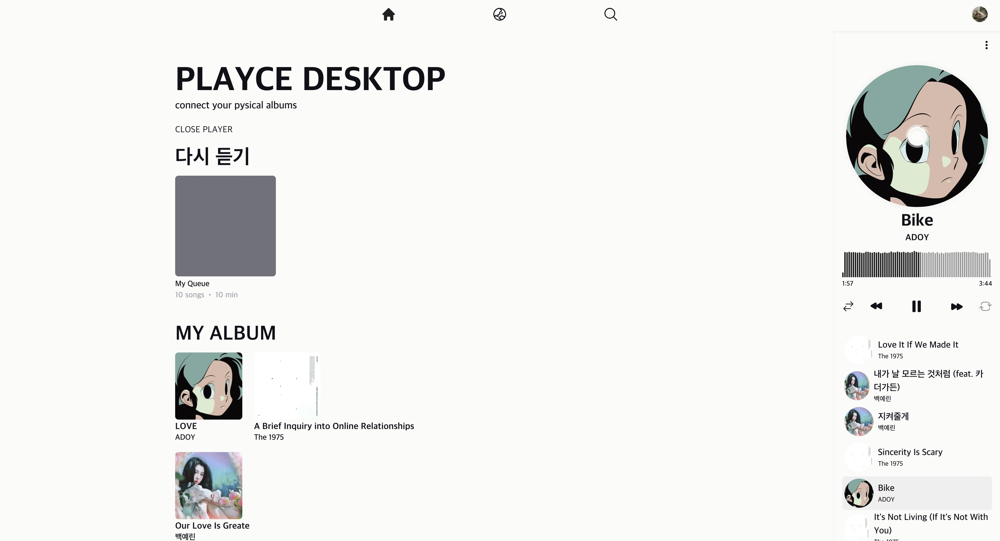
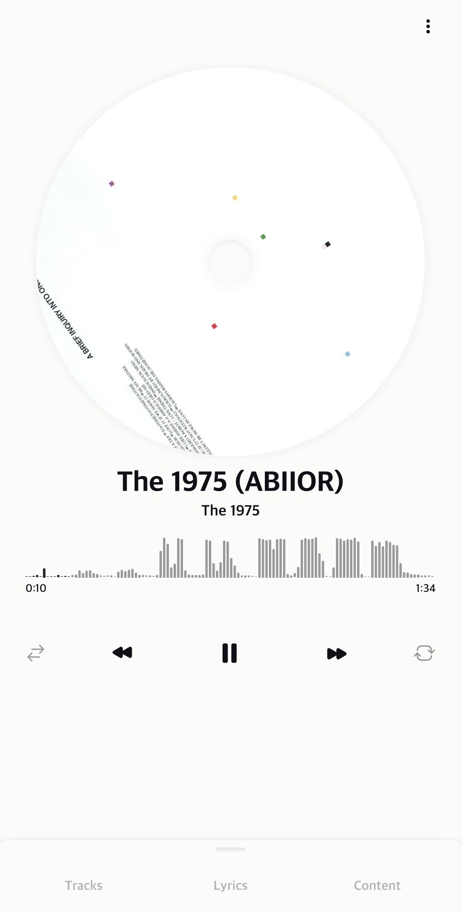
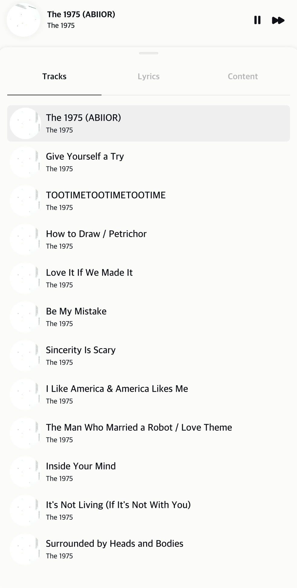

# PLAYCE
**playce**는 ***connect your pysical albums*** 라는 슬로건의 개념을 구현하기 위한
Front End 토이 프로젝트 입니다.  

우리의 공간 한 켠에 방치되어 있는 피지컬 앨범에 생명력을 불러 넣어줄 수 있는 방법이 없을까? 라는 의문에서 시작되었습니다.  

피지컬 앨범은 플레이어에 앨범을 교체해가며 듣기에 번거롭기도 하며, 스트리밍이라는 대체제로 인해 음원 청음이라는 기능이 퇴색 되어가고 있습니다. 단순히 수집, 이벤트 응모 등을 위한 수단으로 전락되고 있는 피지컬 앨범의 가치에 생명력을 불어 넣음으로써 공간을 단순히 차지하고 있는 것이 아닌, 공간에 음향을 더할 수 있도록 playce 프로젝트를 진행하고 있습니다.

 

**현실 세계에 존재하는 앨범의 가치를 더욱 빛내기 위해 다음과 같은 아이디어를 구현하기 위해 노력하고 있습니다.**

- 피지컬 앨범을 서비스에 등록하여 스트리밍
- 서비스에서 피지컬 앨범 구매 및 스트리밍
- 앨범 booklet과 같은 피지컬 앨범의 요소를 제공
- 뮤지션과의 리스너 간의 직접적인 연결 창구 제공 (서비스에서 음원 발매를 위한 크라우딩 펀딩, 커뮤니티 기능 제공)
- 사용자 간의 피지컬 앨범 판매/구매/교환 창구 제공 (소유권 및 스트리밍 권한 이전)

 
 

# 개발 스택
FrontEnd 
- NextJS, Redux, Zustand, tanstack-query, wavesurfer.js, styled-component, tailwind

 

BackEnd (예정)
- NestJS (구현을 위한 단순한 서버)

 
 

||||
|----|----|----|
||||
|||

<!-- <table>
  <tr>
     <td></td>
     <td></td>    
     <td></td>
  </tr>
  <tr>
     <td></td>
     <td></td>    
     <td></td>
  </tr>
  <tr>
     <td></td>
     <td colspan="2"></td>
  </tr>
</table> -->

# 개발 내역
## 23-04-28 ~ 23-07-07
styled-compoent, tailwind 를 통한 모바일, 태블릿, 데스트톱 폼팩터에 대한 반응형 디자인 구현  
react-modal-sheet(일부 수정), framer-motion 을 통한 플레이어 바텀 시트 구현  
wavesurfer, redux, custom hooks 를 통한 **음원 시각화 및 컨트롤 기능** 구현   
로그인, 회원 가입 폼 구현 (기능 x)

## 23-07-08
**queue 기능 개발**  
Play List 기능보다 좀 더 직관적이고, 간편하게 재생 목록을 컨트롤할 수 있는 개념의 큐
앨범, 플레이리스트 등으로부터 즉각적으로 큐에 트랙을 추가하고, 플레이리스트보다 더 간편하게 큐로부터 트랙을 제거할 수 있습니다.
